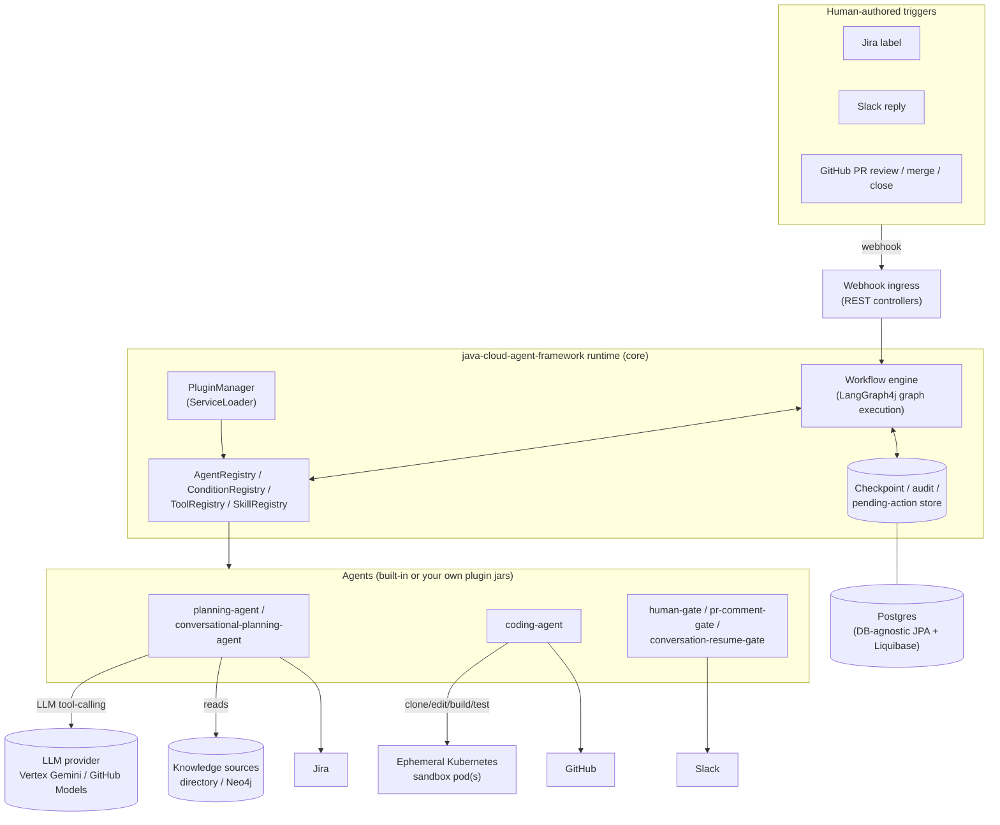
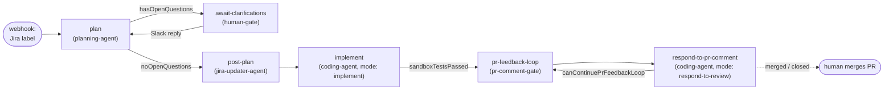
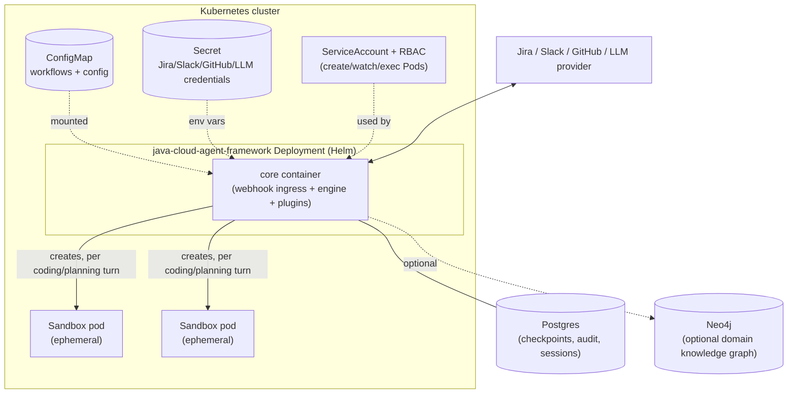
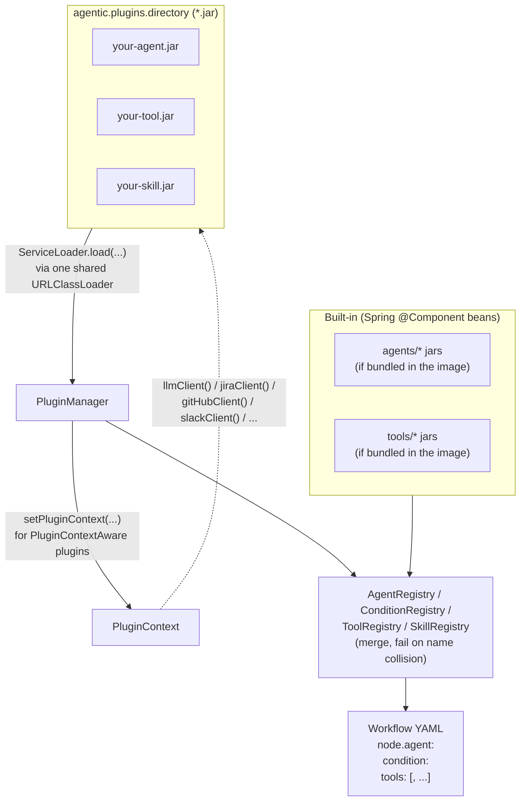

# java-cloud-agent-framework

**A generic, cloud-native, Java/Spring framework for building and
deploying fully autonomous or semi-autonomous agents — with a human in the loop.**

At its core, this is a domain-agnostic **workflow graph engine**: it
executes durable, pausable/resumable graphs of **agents**, defined
entirely in YAML, running in a container in your own Kubernetes cluster,
triggered by webhooks and driven by an LLM of your choice. Nothing about
the engine, persistence, webhook ingress, plugin loading, or observability
layer is specific to any one domain.

The **primary, out-of-the-box use case this repo ships** is aimed at
software engineering teams: read a refined Jira ticket, draft an
implementation plan, ask a human when genuinely unsure, implement the
change in an isolated sandbox, open a PR, and react to review feedback —
while a human stays in control of anything risky (merging code) and can
jump in at any point (Slack, Jira, GitHub PR comments).

But the same graph engine, plugin contract, and human-in-the-loop
primitives (Slack/webhook gate nodes, multi-round `askHuman`
conversations, approval checkpoints) are **not** specific to software
delivery. A sales-qualification agent that drafts outreach and pauses for
a rep's approval, a marketing agent that drafts campaign copy and loops in
a brand reviewer, or a customer-support agent that drafts a reply and
escalates to a human on low confidence are all the same shape of problem —
"draft with an LLM, know when to ask a human, act, follow up" — and can be
built as their own `Agent`/`ToolBundle`/`Skill` plugins against this same
runtime, with zero changes to the framework itself. See
[Bringing your own agents, tools, skills, and knowledge](#bringing-your-own-agents-tools-skills-and-knowledge).

It is deliberately **not** a single opinionated "AI dev bot." It's a
graph-execution runtime plus a plugin contract: this repo ships one
complete, real, out-of-the-box workflow (Jira ticket → plan → PR → review
response) built entirely on that same public plugin contract, so you can
use it as-is, extend it, or replace every agent with your own — for
software delivery or an entirely different domain — while keeping the
runtime (persistence, pause/resume, webhook ingress, LLM/tool plumbing,
plugin loading, observability) as-is.

## Table of contents

- [How it works](#how-it-works)
- [Out-of-the-box agents](#out-of-the-box-agents)
- [Out-of-the-box tools](#out-of-the-box-tools)
- [Example workflows](#example-workflows)
- [Tech stack](#tech-stack)
- [Architecture decisions](#architecture-decisions)
- [Building and running locally](#building-and-running-locally)
- [Running in the cloud](#running-in-the-cloud)
- [Bringing your own agents, tools, skills, and knowledge](#bringing-your-own-agents-tools-skills-and-knowledge)
- [Repository layout](#repository-layout)

## How it works

1. A human refines a task's requirements — e.g. in a Jira ticket — and
   flags it ready (a label). That fires a webhook into the framework.
2. A **planning agent** reads the requirements plus relevant domain
   knowledge (a local directory of docs, or a Neo4j-backed knowledge
   graph) and drafts an implementation plan. If it isn't confident about
   something, it starts a Slack thread and **pauses the workflow** —
   durably, surviving restarts — until a developer replies.
3. Once the plan has no open questions, it's posted back to the Jira
   ticket, and a **coding agent** implements it inside an isolated,
   ephemeral Kubernetes sandbox pod (clone → explore → edit → build/test →
   diff) and opens a PR.
4. Reviewer comments on the PR resume the same coding agent, which decides
   whether a code change is needed, replies, and pushes an amending commit
   if so — looping for as many review rounds as the PR needs.
5. **Humans merge the PR.** No further agentic involvement — this
   framework never merges code on its own.

Every step above is just a node in a workflow graph
(`workflows/examples/jira-to-pr.yaml`), executed by
[LangGraph4j](https://github.com/langgraph4j/langgraph4j) with durable,
Postgres-backed checkpointing so a pause (waiting on Slack, a GitHub
event, or a future approval) can last minutes or days and resume exactly
where it left off, even across a pod restart. See
`docs/adr/0001-*.md`–`0002-*.md` for the persistence/pause-resume design.

### Architecture



- **Webhook ingress** turns an external event (Jira label, Slack reply,
  GitHub PR event) into a workflow start/resume call.
- **The engine** is a thin LangGraph4j wrapper: it resolves each node's
  agent from `AgentRegistry`, runs it, evaluates edge conditions from
  `ConditionRegistry`, and persists a checkpoint after every step so a
  pause survives a restart.
- **Agents/tools/conditions/skills** are resolved from one merged
  registry per type, populated from both Spring-bean (built-in) and
  `ServiceLoader`-discovered (plugin jar) implementations — see
  [Plugin loading model](#plugin-loading-model) below.
- **The coding agent** is the only piece that reaches outside the
  application pod itself, spinning up a short-lived sandbox pod per
  turn — everything else (planning, gating, LLM calls) runs in-process.

## Out-of-the-box agents

See **[`agents/README.md`](agents/README.md)** for the full index,
workflow diagram, and shared conventions, and each module's own README for
its exact behavior, state contract, and configuration:

| Agent | Role |
|---|---|
| [`planning-agent`](agents/planning-agent/README.md) | Drafts a plan from ticket + domain knowledge; flags open questions |
| [`slack-gate-agent`](agents/slack-gate-agent/README.md) | Fixed single-round Slack clarification gate |
| [`conversational-planning-agent`](agents/conversational-planning-agent/README.md) | Same as planning, but drives its own multi-round `askHuman` conversation |
| [`conversation-resume-gate-agent`](agents/conversation-resume-gate-agent/README.md) | Generic pause point reused by every conversation-session agent |
| [`jira-updater-agent`](agents/jira-updater-agent/README.md) | Posts the finalized plan back to Jira |
| [`coding-agent`](agents/coding-agent/README.md) | Implements the plan and opens a PR; reacts to PR review feedback |
| [`pr-comment-gate-agent`](agents/pr-comment-gate-agent/README.md) | Waits for the next PR review/merge/close event |

## Out-of-the-box tools

See **[`tools/README.md`](tools/README.md)** for the full index and shared
conventions, and each module's own README for its exact `@Tool` methods:

| Tool | What it gives the LLM |
|---|---|
| [`file-read-tool`](tools/file-read-tool/README.md) | Read one file from a GitHub repo, no clone needed |
| [`github-api-tool`](tools/github-api-tool/README.md) | List an org's repos / search code across GitHub |
| [`workspace-setup-tool`](tools/workspace-setup-tool/README.md) | Clone a repo into a sandbox pod, list/read/search it |
| [`file-edit-tool`](tools/file-edit-tool/README.md) | Write files, run build/test commands, diff a sandbox workspace |
| [`http-request-tool`](tools/http-request-tool/README.md) | Fetch an arbitrary URL (e.g. internal docs/wiki pages) |
| [`ask-human-tool`](tools/ask-human-tool/README.md) | Pause an LLM turn to ask a human a clarifying question |
| [`tool-support`](tools/tool-support/README.md) | Shared helper (`ToolResults`) used by the other tool modules |

Both agents and tools use the same plugin contract — see
[Bringing your own agents, tools, skills, and knowledge](#bringing-your-own-agents-tools-skills-and-knowledge).

## Example workflows

`workflows/examples/` has two complete, runnable variants of the same
Jira → plan → PR → review-response flow:

- **[`jira-to-pr.yaml`](workflows/examples/jira-to-pr.yaml)** — fixed
  single-round-per-Slack-reply clarification (`planning-agent` +
  `human-gate`).
- **[`jira-to-pr-conversational.yaml`](workflows/examples/jira-to-pr-conversational.yaml)** —
  multi-round, LLM-driven clarification via `askHuman`
  (`conversational-planning-agent` + `conversation-resume-gate`), the
  "cloud Copilot CLI"-style alternative. See ADR-0003 for why both models
  are kept side by side.

Both share identical `implement` / `pr-feedback-loop` /
`respond-to-pr-comment` downstream nodes — only the planning stage
differs:



The conversational variant swaps `plan`/`await-clarifications` for
`conversational-planning-agent`/`conversation-resume-gate` — every
downstream node is identical.

## Tech stack

| Concern | Choice |
|---|---|
| Language / runtime | Java 25 (LTS) |
| Application framework | Spring Boot 4.1 / Spring Framework 7 |
| Workflow graph engine | [LangGraph4j](https://github.com/langgraph4j/langgraph4j) 1.8.20 |
| LLM integration | [Spring AI](https://spring.io/projects/spring-ai) 2.0.0 — Vertex AI Gemini (Google GenAI) or GitHub Models (OpenAI-compatible), config-selected |
| Persistence | JPA/Hibernate (`ddl-auto: validate`) + Liquibase-managed schema, Postgres by default — **deliberately DB-agnostic**: `WorkflowState`'s serialization and `LangGraph4j` checkpoint storage are designed to work unchanged against another JSON-capable relational store (e.g. Spanner) later |
| Knowledge sources | Local directories of plain-text/Markdown, or a Neo4j-backed knowledge graph (plain Neo4j Java driver) |
| Sandbox execution | Kubernetes pods (fabric8 `kubernetes-client`), one ephemeral pod per coding/planning turn |
| Git operations | [JGit](https://www.eclipse.org/jgit/) (clone/branch/commit/push, diff application) |
| Build | Gradle (Kotlin DSL), multi-module |
| Packaging | Docker (multi-stage, layered jars), Helm chart for Kubernetes |
| Observability | Spring Boot Actuator + Micrometer/Prometheus, structured JSON logs |
| Plugin mechanism | JDK `ServiceLoader` — every built-in agent/tool is loaded exactly like a third-party plugin jar |

## Architecture decisions

Every significant design decision is recorded as an ADR in
[`docs/adr/`](docs/adr/README.md) — start there for the *why* behind
persistence, pause/resume, the dual human-interaction model, auto-execute
vs. approval-gated side effects, sandbox workspaces, background execution,
the plugin/`ServiceLoader` mechanism, `ToolBundle`s, and the module
packaging model.

## Building and running locally

Prerequisites: JDK 25, Docker (for Postgres/Neo4j via `docker compose`).

```bash
./gradlew build          # build every module
./gradlew bootRun         # run core with zero real integrations —
                           # Jira/Slack/GitHub/sandbox/LLM all default to
                           # logging stubs, so nothing external is required
                           # just to see the app start and accept webhooks
```

By default the app runs with every external integration stubbed out
(`Logging*Client` beans that just log what they *would* have done) and
zero built-in agents loaded (the bare `core` module has no agent/tool
jars on its classpath) — useful for exercising the webhook/engine/
persistence layer in isolation.

To actually run the reference `jira-to-pr` workflow end-to-end against
**real** Jira, Slack, GitHub, an LLM, and a real local Kubernetes sandbox
(via minikube), see the full walkthrough in
**[`docs/local-testing.md`](docs/local-testing.md)** — it covers starting
Postgres/Neo4j, building/loading the sandbox workspace image, exporting
credentials, and triggering + following the workflow through Slack/Jira/
GitHub.

Run the built-in agents/tools locally the same way they run in
production — as plugin jars — by building them and pointing
`agentic.plugins.directory` at their output:

```bash
./gradlew :agents:planning-agent:jar :tools:file-read-tool:jar   # ...and so on
mkdir -p /tmp/agentic-plugins
cp agents/*/build/libs/*.jar tools/*/build/libs/*.jar /tmp/agentic-plugins/
./gradlew bootRun --args='--agentic.plugins.directory=/tmp/agentic-plugins'
```

Targeted tests:

```bash
./gradlew :core:test                              # engine/plugin/registry/config
./gradlew :agents:coding-agent:test                # one agent module
./gradlew :agents-integration-tests:test           # full end-to-end flow tests,
                                                    # loading every built-in
                                                    # agent/tool jar via the same
                                                    # ServiceLoader mechanism
                                                    # used in production
```

## Running in the cloud

### Deployment topology



Each sandbox pod is short-lived (one per LLM planning/coding turn, torn
down afterward, with an `activeDeadlineSeconds` safety net) and runs the
image built from `Dockerfile.sandbox-workspace` — never the app's own
image or pod.

### Container images

`Dockerfile` builds two runtime targets from one shared build stage:

- **`runtime`** (the default/bare image) — zero built-in agents, an empty
  `/opt/agentic/plugins`. Bring your own agent/tool jars.
- **`runtime-with-default-modules`** — the bare image plus every
  out-of-the-box agent/tool jar from this repo pre-copied into
  `/opt/agentic/plugins`:
  ```bash
  docker build --target runtime-with-default-modules \
    -t java-cloud-agent-framework:X.Y.Z-with-default-modules .
  ```

A separate `Dockerfile.sandbox-workspace` builds the image every
per-task sandbox pod runs (git, Java/Maven, Node/npm, Go, Python, Docker
CLI preinstalled) — see the Helm chart README's "Sandbox workspace image"
section for building/pushing it and layering extra toolchains on top.

### Building your own image with your own agents

Your own agent/tool/skill plugins live in **their own repository**, built
with their own Gradle/Maven build against this framework's published API
(see [Bringing your own agents, tools, skills, and knowledge](#bringing-your-own-agents-tools-skills-and-knowledge)),
producing a plain jar per plugin. You then layer those jars onto the bare
`java-cloud-agent-framework` image — no fork of, or build dependency on, this
repo required.

A minimal derived `Dockerfile` in *your* repository:

```dockerfile
# your-agents-repo/Dockerfile
FROM ghcr.io/manevpe/java-cloud-agent-framework:X.Y.Z AS base

# Build your own plugin jars in a separate stage so the final image
# doesn't carry a JDK/Gradle toolchain — mirrors this repo's own
# multi-stage Dockerfile.
FROM eclipse-temurin:25-jdk-noble AS build
WORKDIR /workspace
COPY . .
RUN ./gradlew --no-daemon \
    :sales-agent:jar \
    :sales-tools:jar

FROM base
USER root
COPY --from=build /workspace/sales-agent/build/libs/*.jar /opt/agentic/plugins/
COPY --from=build /workspace/sales-tools/build/libs/*.jar /opt/agentic/plugins/
# Bring your own domain knowledge and workflow YAML the same way — see
# "Bring your own domain knowledge" below and the Helm chart's
# ConfigMap-based workflow mounting; knowledge files can also be baked in
# here if you'd rather not use a volume mount:
COPY knowledge/ /app/extracted/knowledge/
RUN chown -R agentic:agentic /opt/agentic/plugins /app/extracted/knowledge
USER agentic:agentic
```

```bash
docker build -t my-org/sales-agent-framework:1.0.0 .
docker push my-org/sales-agent-framework:1.0.0
```

Notes:
- Start `FROM` the **bare** `java-cloud-agent-framework:X.Y.Z` tag, not the
  `-with-default-modules` one, unless you actually want this repo's Jira/
  GitHub/coding agents loaded alongside your own — plugin `type()`/
  `name()` values must be globally unique, so mixing in unrelated
  built-ins is fine as long as nothing collides.
- Everything under `/opt/agentic/plugins` is picked up automatically at
  startup (`agentic.plugins.directory` already points there in the base
  image) — no extra config needed for the plugin-loading part itself.
  You still need to set `agentic.agents.disabled-types` if you want to
  turn off a built-in agent that came along with the base image, and
  point `agentic.workflows.directory` (or mount a Helm-managed ConfigMap,
  see below) at your own domain's workflow YAML instead of this repo's
  Jira/PR example.
- This pattern works identically for a completely different domain
  (sales/marketing/support): your plugin jars, your workflow YAML, your
  knowledge sources — the base image and everything it provides
  (persistence, webhook ingress, pause/resume, plugin loading) needs no
  changes at all.

### Deploying with Helm

```bash
helm install my-release deploy/helm/java-cloud-agent-framework \
  --set image.tag=X.Y.Z-with-default-modules
```

The chart (full reference: **[`deploy/helm/java-cloud-agent-framework/README.md`](deploy/helm/java-cloud-agent-framework/README.md)**)
covers:

- **Workflows without an image rebuild** — workflow YAML is mounted from
  a ConfigMap (`values.workflows`), not baked into the image; `helm
  upgrade` triggers a rolling restart via a config-checksum pod
  annotation whenever it (or `values.config`) changes.
- **Supplying plugin jars** against the bare image — either a derived
  image (`FROM` the bare image, `COPY` your jars into
  `/opt/agentic/plugins`), or an externally-supplied volume (e.g. an
  `initContainer` fetching jars from an OCI registry, or a pre-populated
  PVC) via `plugins.enabled: true`.
- **Secrets** — plaintext via `secrets.values` for a first deploy/dev
  cluster, or point `secrets.secretRefName` at a pre-created Secret
  (Sealed Secrets, External Secrets Operator, ...) for anything real.
- **Health probes** (`/actuator/health/{liveness,readiness}`) and metrics
  (`/actuator/prometheus`), backed by Spring Boot's own Kubernetes
  health-probe groups.
- **Sandbox workspace image + Docker-in-Docker** — how `CodingAgent`'s
  ephemeral pods are configured, and the (off-by-default, privileged)
  Testcontainers-support sidecar.

## Bringing your own agents, tools, skills, and knowledge

Everything in `agents/*` and `tools/*` is built entirely on this
framework's own public plugin contract — there is no special-cased
"built-in" path. A separate repository can add or replace any of it
without ever forking this one:

1. **Implement one of the plugin interfaces** — `Agent` (a workflow node),
   `EdgeCondition` (a routing predicate), `ToolBundle` (a named,
   reusable set of LLM tools), or `Skill` (a tool bundle + prompt
   fragment a conversational agent opts into by name).
2. **Declare it via `ServiceLoader`**: a
   `META-INF/services/io.github.manevpe.agentic.agent.Agent` (or the
   matching interface) file in your jar, listing your implementing
   class's fully-qualified name.
3. **Need a framework collaborator** (the LLM client, Jira/GitHub/Slack
   clients, the sandbox workspace client, ...)? Also implement
   `PluginContextAware` — `PluginManager` injects the same
   Spring-managed singletons a built-in agent gets via constructor
   injection.
4. **Build a plain jar** (`./gradlew jar` — no shading, no Spring Boot fat
   jar; the framework's own classes are already on the classpath at
   runtime) and drop it into the directory configured as
   `agentic.plugins.directory`.
5. **Reference it from workflow YAML** by `type()`/`name()` — a plugin
   can extend the framework but never silently shadow a built-in (a name
   collision fails startup).
6. **Bring your own domain knowledge** the same way built-in workflows do
   — point a node's own `knowledgeSources: [{type: directory, path:
   ...}]` config at your own directory of docs (mounted into the
   container, e.g. via a ConfigMap/volume), or `{type: neo4j, database:
   ...}` at your own knowledge-graph database. Nothing about knowledge
   sources is hardcoded to this repo's `knowledge/` example directory.

### Plugin loading model



Built-in and plugin-provided implementations are indistinguishable once
merged — a workflow node references an agent by `type()` with no idea
(or need to know) whether it came from this repo's `agents/*` jars or a
jar you built in a completely separate repository.

Start from **[`plugins-template/`](plugins-template/README.md)** at the
repo root — three copy-and-adapt template modules
(`agent-template/`, `tool-template/`, `skill-template/`) plus a full
walkthrough. The full plugin contract, stable API surface, and deployment
patterns (bare vs. `-with-default-modules` image) are documented in
**[`docs/plugins.md`](docs/plugins.md)**. This repo's own `agents/*`/
`tools/*` modules are themselves a complete, real-world example of the
exact same contract — worth reading alongside the templates.

## Repository layout

```
core/                          Deployable Spring Boot app: engine, webhook
                                ingress, persistence, plugin loading,
                                LLM/Jira/GitHub/Slack/Neo4j/sandbox
                                integrations. Zero built-in agents.
agents/                        One Gradle module (jar) per built-in Agent.
tools/                         One Gradle module (jar) per shareable ToolBundle.
agents-integration-tests/      Full end-to-end flow tests loading every
                                built-in agent/tool jar via ServiceLoader.
plugins-template/              Copy-and-adapt starting points for your own
                                agent/tool/skill plugin modules.
workflows/examples/            Complete, runnable example workflow YAML.
knowledge/                      Example domain-knowledge directories.
deploy/helm/                   Kubernetes Helm chart.
docs/                          ADRs, plugin contract, local-testing guide.
Dockerfile, Dockerfile.sandbox-workspace   Container image builds.
```
